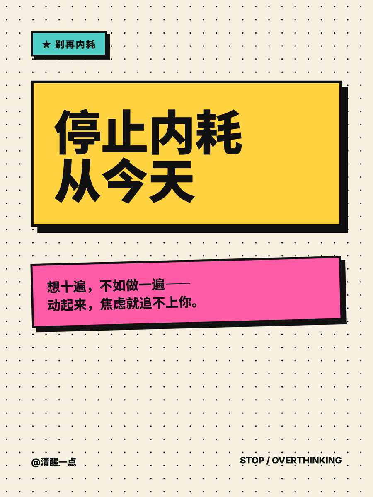
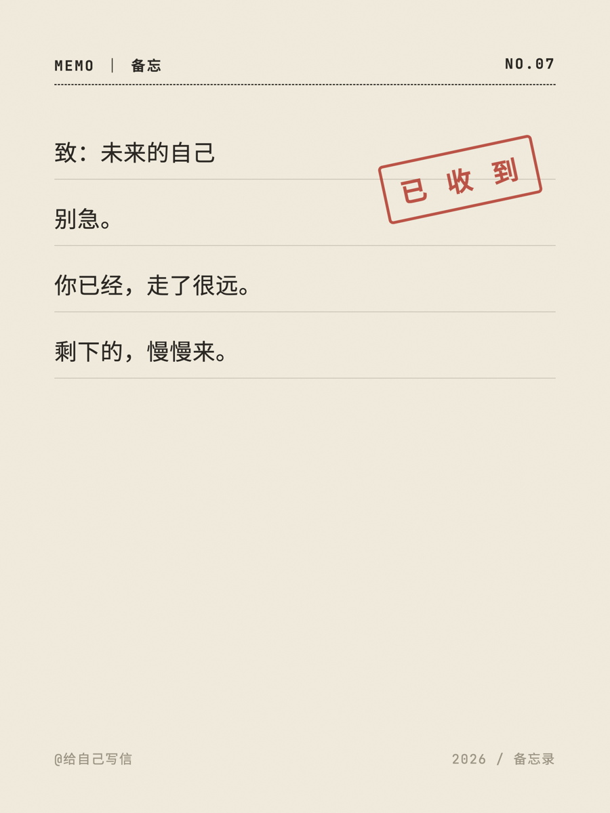

# Card Layout · 小红书图文卡片排版器

一个给 coding agent 用的 skill:把**已经写好的文字(+可选图片)**,排成小红书 / 公众号的 **3:4 图片连发**(1080×1440)。打包成 Claude Code 插件。

> 不写文案,只排版出图——你把文字和图丢进来,它读懂、切卡、自动配图、给你看图选风格、渲染成一整套可直接发的卡片。

## 它解决什么

用「**show, don't tell**」:不让你用语言描述想要什么风格,而是**读懂内容 → 切好卡 → 给你真样张看图选**。三件它替你做的事:

1. **读稿切卡** — 逐段判断最适合哪种模块(封面/正文/概念/数据/对比/步骤/金句/清单/封底/图文)。
2. **自动配图** — 你只管把图丢进来,它**看图 + 读稿自动配到对应段落**,零标注。
3. **看图选风格** — 从 10 套内置风格按内容筛出合适的,渲样张给你挑。

## 安装

从本 GitHub 仓库装。**分两条消息发**:

```text
/plugin marketplace add https://github.com/zhy9495/card-layout
```

完成后:

```text
/plugin install card-layout@card-layout
```

然后输入 `/card-layout:card-layout` 调用,把文字贴进来、图片一起丢进来即可。

> 手动安装:`git clone` 本仓库后,把 `skills/card-layout/` 整个放进你的 `~/.claude/skills/`。

## 10 套内置风格

| 风格 | 母题 | 调性 | 适合 |
|---|---|---|---|
| 暖纸编辑 warm-editorial | 杂志衬线 | 暖·克制·留白 | 情感/生活/方法论 |
| 瑞士网格 swiss-grid | 国际主义 | 理性·专业 | 英语/知识/职场 |
| 版画长文 vintage-collage | 复古拼贴 | 安静·艺术 | 心理/情感长文 |
| 彩色文件夹 folder-doodle | 桌面拟物 | 俏皮·热闹 | 分类/并列 |
| 包豪斯 bauhaus | Bauhaus | 大胆·几何 | 设计/思维 |
| 粗野 neo-brutalism | Neo-Brutalism | 冲·直接 | 清醒/观点 |
| 性冷淡 minimal-quiet | 极简主义 | 安静·高级 | 极简生活/审美 |
| 得意黑海报 bold-poster | Bold Poster | 冲击·宣言 | 自律/搞钱 |
| 孟菲斯 memphis | Memphis 80s | 活泼·俏皮 | 松弛/生活 |
| 打字机便签 typewriter-memo | 索引卡 | 低调·手作 | 自我对话/治愈 |

每套都覆盖全部模块 + 4 种图文版式(上图下文 / 左图右文 / 双竖图拼 / 四图网格)。

## 样张

| | | |
|:--:|:--:|:--:|
| <br>暖纸编辑 | <br>瑞士网格 | <br>版画长文 |
| <br>彩色文件夹 | <br>包豪斯 | <br>粗野 |
| <br>性冷淡 | <br>得意黑海报 | <br>孟菲斯 |
| <br>打字机便签 | | |

## 完整文档

- 工作流与规则:[`skills/card-layout/SKILL.md`](skills/card-layout/SKILL.md)
- 详细说明与扩展(怎么加新风格):[`skills/card-layout/README.md`](skills/card-layout/README.md)

## 依赖

macOS + Google Chrome(无头出图)· `python3` + `Pillow`(拼图自审)· 中文 webfont 走 CDN(渲染时联网)。

## 致谢 · 许可

方法论参考 [归藏 social-card-skill](https://github.com/op7418/guizang-social-card-skill) 与 [Zara Zhang · frontend-slides](https://github.com/zarazhangrui/frontend-slides)。MIT License。
